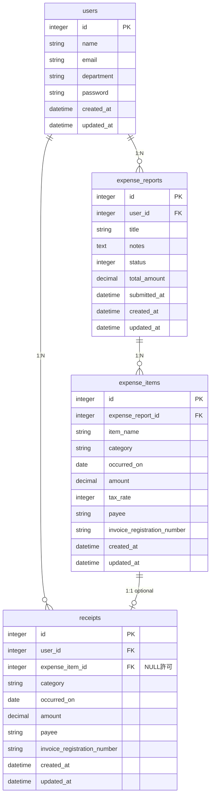

# KeiHi --立替費用申請アプリ

## どんなサービス？
「あとで申請しよう」が積み上がって、気づけば締切。そんな取りこぼしをなくす経費精算アプリです。

## サービス画像

## URL
https://keihi-app-niww.onrender.com

## サービス概要
立替経費の申請忘れを防ぐ、申請者向けのWebアプリです。
申請の入力の手間は、OCRによる自動読み取りや確認しやすい画面でできるだけなくしました。一方で、「つい後回しにする」「少額だからと諦める」という"申請そのものの腰の重さ"は、人の性質として簡単にはなくせません。本アプリはそこを変えようとするのではなく、後回しを許したうえで取りこぼしをできるだけ防ぐことに重きを置いています。

受け取った領収書は、まず撮って保存するだけ（レシートBOX）。金額や日付はOCRが自動で読み取り、申請は後でまとめて行えます。また、未申請の金額と月の締日までの日数をダッシュボードで可視化することで、申請の意識づけを促し、後回しにしてもできるだけ取りこぼさない仕組みにしています。
なお、出張日当や細かい税区分など実務固有のルールは扱わず、「撮る→申請→承認」の基本フローに絞ってシンプルに構成しています。

## 開発背景
普段の業務で使っている経費申請アプリが使いづらく、それを改善したいと思ったのがきっかけです。
テーブルが画面に収まらず横スクロールが発生する、入力はすべて手打ちでインボイス番号や支払先のミスが起きやすい、申請のステータスが分からないなど——こうした不満から、当初はOCRによるレシート読み取り機能を中心に開発を始めました。

ですが、実際の業務を振り返ると、課題は「入力の手間」だけではなく、「申請忘れ」「締切超過」「領収書管理」によって立替の回収が遅れてしまうことにあると気付きました。実際に、後で忘れないようにと領収書をスマートフォンで撮影したものの、そのまま申請を忘れてしまう、締日を過ぎると、少額なら申請しなくてもいいと諦めてしまうといった声を聞いていました。こうなると、申請者が精算を受けられないだけでなく、本来その月に計上されるべき経費が翌月へずれる原因にもなります。
そこで本アプリは、入力コストを減らしつつ、"面倒くささも許容する"という設計に行き着きました。受け取ったレシートを「とりあえず撮るだけ」にすることで申請のハードルを下げ、立替経費を申請前から管理できる仕組みを取り入れました。

## 機能

**レシートBOX**
- 受け取った領収書を撮影/アップロードして保存
- OCRが金額・日付などを読み取り
- 一覧で表示、合計金額もひと目で把握
- 明細作成時にBOXから選んで、読み取り済みの内容をそのまま反映

**ダッシュボード**
- 未申請の金額（レシートBOX＋下書きの金額の合計）を最優先で大きく表示
- 下書き・提出済み・承認済みの件数
- 最近の申請一覧表示（申請日・金額・ステータス付き）

**申請一覧・申請詳細**
- ステータス・申請期間指定でフィルタリング
- ページネーション対応
- 明細一覧
- 明細詳細をトグルで展開
- 領収書画像・PDFのプレビュー

**申請作成**
- 手入力または領収書の自動読み取りで入力
- 領収書画像・PDFのアップロード対応
- カテゴリ・税率の選択

**セルフチェック**
- 同じ申請内の重複明細を検出
- 過去の申請との重複を検出
- 領収書が未添付の明細を警告

**ログイン**
- メールアドレス・パスワードでの認証
- ゲストログイン

## 使い方

### レシートを撮影・保存する
1. トップページの「ゲストログイン」からすぐに試せます
2. ダッシュボードの「レシートを撮る」で領収書を撮影(モバイルのみ)
3. OCRで自動読み取り → レシートBOXに保存されます

### 経費を申請する
4. 「新規作成」から申請を作成し、タイトルを入力
5. 「明細を追加」から明細を登録（3つの方法）
   - レシートBOXから選択（撮影済みデータを自動入力）
   - 領収書をアップロードしてOCR自動入力
   - 手入力
6. 提出前にセルフチェックで内容を確認
7. 提出完了

## こだわりポイント
#### 「ちょっとしたストレスを減らす」

**① 明細入力モーダルを2カラム構成に**
- 左に入力フォーム、右に領収書プレビューを並べたレイアウト
- ドラッグ&ドロップでアップロードした領収書を見ながら入力・修正できるため、OCRの読み取り結果の確認や誤入力の修正がスムーズ
- PDF・画像どちらも対応しており、`content_type` で判定して表示方法を切り替えています

**② バリデーションエラーは「入力し始めたら」消える**
- `input` イベントで、入力を始めた瞬間に赤枠・エラーメッセージが消えるようにしました
- エラーが出た時点で多くのユーザーは何を直すべきか理解できると思います。入力の際にエラーが残り続けるより、早めに消した方が良いと個人的に思っています。
- 実装面では、422レスポンス時は `turbo:load` が発火しないため、`turbo:render` イベントも監視するよう対応しています

**③ セルフチェックは「過去の申請」も含めて重複チェック**
- 申請内の明細だけでなく、過去に提出・承認済みの申請の明細とも照合して重複を検知します
- 「同じ領収書を2回申請してしまった」というヒューマンエラーを未然に防ぐことを意識しました

**④ 提出確認画面はトグルで明細を展開**
- 明細の入力はモーダルで行うため、確認画面での見せ方を工夫しました
- トグルで明細を展開・折りたたみできる構成にすることで、一覧性と詳細確認を両立しています

## 使用技術

| カテゴリ | 技術 |
|---|---|
| バックエンド | Ruby on Rails 7.2.3 |
| データベース | PostgreSQL |
| フロントエンド | HTML / CSS / JavaScript, Bootstrap 5, Hotwire（Turbo / Stimulus）|
| 認証 | Devise |
| ファイルアップロード | Active Storage + Cloudinary |
| 領収書読み取り | Claude API |
| グラフ描画 | Chart.js |
| 画像圧縮 | browser-image-compression |
| 日付入力 | Flatpickr |
| テスト | RSpec・FactoryBot（モデル・一部のリクエストテスト） |
| CI | GitHub Actions |
| インフラ | Render |
| デザイン | Google Stitch, Figma |

## 技術選定理由

### Ruby 3.3.3 / Rails 7.2.3
スクールで学んだRuby on Railsを採用。バージョンはプロジェクト開始時点の安定版を選定。

### PostgreSQL
Renderの標準DBであり、本番環境との互換性を重視。

### Bootstrap 5
モーダル・ドロップダウン・オフキャンバスなど、業務アプリに必要なUIコンポーネントが豊富。経費精算という業務ツールの性質上、Tailwindのようなモダンなデザインよりも、Bootstrapの堅実で統一感のあるUIが適切と判断。

### Hotwire（Turbo / Stimulus）
Rails 7の標準フロントエンド。SPAフレームワーク（React等）を導入せずに、ページ遷移の高速化やフォームの部分更新が実現できる。学習コストと開発速度のバランスを重視。

### Claude API
領収書の読み取りにおいて、従来のOCRサービスと比べ、プロンプトで出力形式を指定するだけで分類まで完了できるため。

### Active Storage + Cloudinary
Active StorageはRails標準の画像管理機能で導入が容易。Renderの無料プランはサーバー再起動時にローカルファイルが消失するため、外部ストレージとしてCloudinaryを採用。

### Chart.js
CDNで導入可能で軽量。

### browser-image-compression
モバイルからの領収書撮影時に、HEIC→JPEG変換とファイルサイズ削減をクライアント側で行い、API通信の高速化とストレージ節約を実現。

### Devise
Rails向け認証の業界標準gem。ゲストログイン機能の実装も容易で、ポートフォリオでの閲覧体験を考慮。

## ER図

## 今後の展望

**直近でやりたいこと**
- ブラウザ通知機能
- 読み取り非同期化
- カテゴリー検索機能
- Request Specを書く

**中長期的にやりたいこと**
- 管理者画面の実装（申請の承認・差し戻し操作など）
- 申請へのコメント機能（差し戻し理由の記載など）
- 交通系IC・クレカの自動連携
- カレンダー連携: Googleカレンダーなどのスケジュールから、訪問先や移動経路を読み取り、自動で交通費を算出
